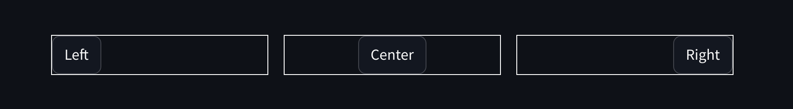

# SAL - Style and Layout for Streamlit

## What does it do?

This library lets you style Streamlit components with ease!
Here is a quick example of what it can do for you:

```sass
// You define SASS style using a predefined placeholder
%sal-button {
  border: 1px dashed antiquewhite
}

// Or you define SASS style using a custom placeholder (*)
%btn-large {
  padding: 12px 18px
  p {
    font-weight:bold
  }
}
```

(*[Read more about custom placeholders](#add-custom-classes-to-sal-components))

Run `streamlit-sal compile`

```python
import streamlit as st
import streamlit_sal as sal
from streamlit_sal import sal_stylesheet

with sal_stylesheet(move_sidebar_right=True):
    # The Streamlit sidebar is now on the right side of the view!

    # This wraps the 'btn-large' and general 'sal-button' styles onto the st.button in the context
    with sal.button('btn-large'):
        large_button = st.button('Big button')

    # It won't affect other usages of st.button
    normal_button = st.button('Streamlit button')
```

Result:


> **Disclaimer**
>
> We cannot guarantee that this library will continue to work for every Streamlit release!

## How to install it?

# TODO: Publish the package

Install with `pip install streamlit-sal`

From the root of your Streamlit app run: `streamlit-sal init`

Fill in the config variables for the desired style source and destination path.
It will then create a `main.scss` in the given source path and a `.streamlit_sal` in the project root path

You can test whether the `init` was successful by running `streamlit-sal compile` which should create a CSS file.

## How to use it?

(*[Make sure to initiate the library first](#how-to-install-it))

Wrap your app code with the stylesheet:

```python
from streamlit_sal import sal_stylesheet

with sal_stylesheet():
    # Your app code goes here!
```

This will render a streamlit markdown element with a style tag containing the compiled CSS before your code

### Add placeholders, compile and render

Navigate to your `main.scss` and start adding the style placeholders that you need. The available predefined
placeholders can be found [here](https://github.com/datarobot/streamlit-sal/PLACEHOLDERS.md). A rule of thumb for
placeholders is that every Streamlit component name
exists with a `sal-` prefix and underscores are replaced by dashes (`st.download_button` -> `sal-download-button`)

Let's take an example for st.button. We add a new border style for the existing placeholder:

```sass
%sal-button {
  border: 1px dashed red
}
```

Now we run `streamlit-sal compile` to create the CSS stylesheet sal-stylesheet.css (default name)

The CSS will now apply to all st.button elements that are wrapped with sal.button():

```python
import streamlit as st
import streamlit_sal as sal
from streamlit_sal import sal_stylesheet

with sal_stylesheet():
    # This wraps the default 'sal-button' styles onto the st.button within the context
    with sal.button():
        st.button('Red Border Button')
```

### Add custom classes to SAL components

SAL can easily be extended with additional custom placeholders/classes. Though it is important to register the
new placeholders with the correct components.

```sass
// Define a custom placeholder (avoid sal- prefix to minimize risk of duplicates)
%btn-large {
  padding: 12px 18px
  p {
    font-weight:bold
  }
}
```

The above placeholder will not be compiled into the final CSS stylesheet yet. It first needs to be registered
to the sal-button. You can find the `$custom-classes` variable at the bottom of your `main.scss`:

```sass
$custom-classes: (
  sal-button: (btn-large),
)
```

Multiple placeholders can be added to the same components and even reused between multiple components:

```sass
$custom-classes: (
  sal-button: (btn-large, btn-primary),
  sal-download-button: (btn-primary),
)
```

### Normal elements vs container elements
Most elements behave the same, but there are some container-type elements that need special treatment.
For these elements you will need to pass down the container to SAL to make it work:
- `with sal.column(..., container=col1):  # From col0, col1 = st.columns(2)`
- `with sal.popover_content(..., container=container):  # From container = st.container()`

SAL should warn you when a container element was not used correctly.


### Advanced Example: Columns with flex and justify



We define custom placeholders for the column:

```sass
%justify-start {
  justify-content: flex-start
}

%justify-center {
  justify-content: center
}

%justify-end {
  justify-content: flex-end
}

%flex-row {
  flex-direction: row

  div {
    // Most streamlit components add width values as inline style. Make it fit the content so justify works.
    width: fit-content !important
  }
}
```

Now we register the new placeholders with `sal-column`:

```sass
$custom-classes: (
  sal-column: (justify-start, justify-center, justify-end, flex-row),
)
```

After `streamlit-sal compile` the styles are prepared, we can move on with the app code.
Note that we here use the col elements and pass them as containers for the sal.column call.
To apply the same column style for any child elements you will need to extend on the col containers (col0, col1, col2)

```python
import streamlit as st
import streamlit_sal as sal
from streamlit_sal import sal_stylesheet

with sal_stylesheet():
    col0, col1, col2 = st.columns(3)
    with sal.column('justify-start', 'flex-row', container=col0):
        col0.button("Left")
    with sal.column('justify-center', 'flex-row', container=col1):
        col1.button("Center")
    with sal.column('justify-end', 'flex-row', container=col2):
        col2.button("Right")
```

## How does it work?

Streamlit does not give users the possibility to add CSS ids or classes. However by adding a span markdown element
we can get the same effect:

```python
import streamlit as st

st.markdown(f"<span class='sal-button'></span>", unsafe_allow_html=True)
st.button("Hello world!")
```

Using `:has(.. span.sal-button)` and a sibling selector (`+`) we can now target that exact `st.button`:

```css
div:has(> div.stMarkdown > div[data-testid="stMarkdownContainer"] span.sal-button) + div button {
    /*Add custom styles*/
}
```

### Building the selectors so you don't have to

SAL uses SASS to dynamically build all the required selectors using
a [component structure map](https://github.com/datarobot/streamlit-sal/blob/main/streamlit_sal/sass/_streamlit-component-map.scss)
and an `@each` loop.
The output CSS will be selectors just like the one seen above. All the defined SASS `%` placeholders are optional and
will not be part of the compiled when not set.

Any new custom classes that are registered properly will also be looped over during `streamlit-sal compile`.


## Troubleshooting

### No styling seems to apply
- Make sure you have wrapped your app code using `with sal_stylesheet():`
- Check that all placeholders in main.scss are defined correctly (`%` not `$`) and brackets are closed. 
- Make sure you have run `streamlit-sal compile`

### The element I try to style has moved outside its container
- It might be a container element, pass it into sal using the `container=` arg [Read more](#normal-elements-vs-container-elements)
